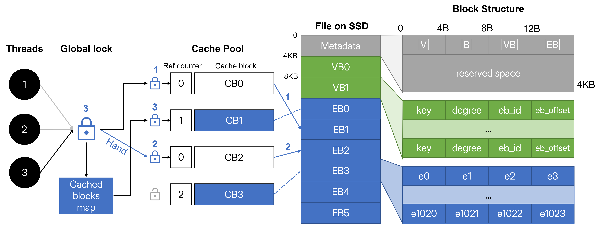
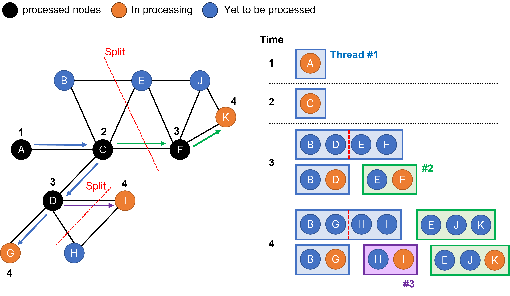

# CAVE - Concurrency-Aware Graph Processing System for SSD

## Overview

*CAVE* is a graph processing engine for
storing, accessing, and performing graph analytics on SSDs. CAVE considers SSD’s supported concurrency through its *internal parallelism* as a key property to exploit and it does so via issuing carefully tuned concurrent I/Os to the graphs stored on a single SSD. *CAVE* adopts a natural *blocked file* format based on adjacency
lists and uses a concurrent cache pool for data blocks to provide ease of implementation of different algorithms.



## Build & Compile

Goto `./cpp` folder, then run `make` for building.

```bash
cd cpp
make
```

**Clang** compiler is specified by default for its better support and performance of multi-threading. Using **GCC** is okay but we won't guarantee the performance.

We tested in the following configurations:

* RedHat Linux 4.9, Clang 11, EXT4 file system.
* Windows 11, GCC 13 + LLVM + UCRT toolchain from winlibs.com, NTFS file system.

## Usage

### Data File Parser

We developed a `parser` to convert common graph data into our binary file structure. It provides simple support for standard adjacent list, edge list files in plain text format, as well as binary adjacency and edge list for compact storage and faster parsing. Please check `/scripts/graph_parser.py` and documentation of [NetworKit package](https://networkit.github.io/) to convert other types of data or make a binary file from plain texts.

Data files with suffix `.adjlist`, `.edgelist`, `.binadj` and `.binedge` will be automatically detected. Otherwise please indicate the file format by the `-format` argument.

```bash
./bin/parser <input_data_path> -format (adjlist/edgelist/binedge/binadj)
```

### Benchmark/Examples

`/bin` includes executables of all algorithms to be tested. We provide BFS, DFS, WCC, PageRank, and Random Walk out of the box. You can implement your algorithms following similar codes.

Our executables supports the following arguments for benchmark usages.

```bash
./bin/[algo] <parsed_data_path> (cache/thread) [args]
```

The following are parameters for the benchmark.

* For cache tests, there's only one argument [0,1,2,3] states that which cache size list you want to run:
  * 0: Only 1024MB. For sanity check.
  * 1: [1,2,3,4,5,10,25,50]. Suggest use for small datasets < 50MB.
  * 2: [20,40,60,80,100,200,500,1000]. For dataset like soc-LiveJounal1 sized ~1GB.
  * 3: [128,256,...,16384]. For very large dataset like com-Friendster.

* For thread tests, 3 arguments are available.  

  * The first one is the minimum number of threads, the second one is the maximum. It tests from the minimum by the power of 2 to the maximum.
  * The third one is optional, for specifying cache size (in MB) for all tests. By defauly it is 1024MB.

Test results will be put in `log` folder in `csv` format.

## Example:

* Benchmark BFS algorithm on [CA-GrQc dataset](https://snap.stanford.edu/data/ca-GrQc.html).

  ```bash
  # Parse data
  ./bin/parser ../data/CA-GrQc.txt -format edgelist

  # Benchmark
  ./bin/bfs ../data/CA-GrQc.bin thread 1 256
  ./bin/bfs ../data/CA-GrQc.bin cache 0
  ```
* Benchmark WCC algorithm on [soc-LiveJournal1 dataset](https://snap.stanford.edu/data/soc-LiveJournal1.html).

  ```bash
  # Parse data
  ./bin/parser ../data/soc-LiveJournal1.binadj

  # Benchmark
  ./bin/wcc ../data/soc-LiveJournal1.bin cache 1
  ```

## Algorithm

To demonstrate the benefits of our system, we implemented parallel algorithms of breadth-first search (BFS), depth-first search (DFS), and weakly connected components (WCC). These algorithms are in `/algorithm`, and can be executed and benchmarked by running corrsponding executables.

### Parallel Pseudo Depth-First Search algorithm



While DFS is inherently a serialized algorithm, it is possible to enhance its performance by introducing parallelism through unordered or *pseudo depth-first search* technique.

We take inspiration from this idea and we incorporate a mechanism to monitor the size of the vertex stack for each thread in our implementation. After visiting the neighbors of a vertex, we check if the size of the stack exceeds a predefined threshold. If it does, the stack is evenly divided into two smaller stacks, and one of these stacks is assigned to a new thread for further exploration.

## Reference

Thread pool library comes from [BS::thread-pool](https://github.com/bshoshany/thread-pool), a fast, lightweight, and easy-to-use C++17 thread pool library. 

To support parallel hashmap used in cache pool, we use [The Parallel Hashmap](https://github.com/greg7mdp/parallel-hashmap), a set of excellent hash map implementations, as well as a btree alternative to std::map and std::set.

Unordered parallel DFS refers to ideas in [A work-efficient algorithm for parallel unordered depth-first search](https://dl.acm.org/doi/10.1145/2807591.2807651).
